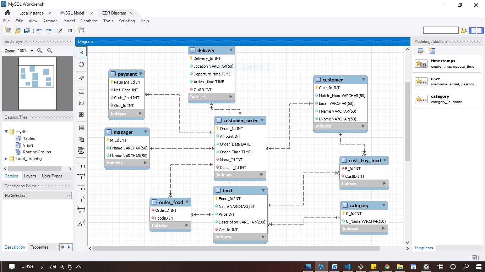

- Course Name: Database Systems
- Instructor: <a href="#">Dr.Budoor Allehyani</a>

# (Food Ordering System)
## Contents:
* An ER schema diagram for the `food_ordering` Database.
* Initial Conceptual Design of the `food_ordering` Database.
* Relational Database Schema.
* EEER Diagram
* The `CREATE DATABASE`,`CREATE TABLE` Commands.
* SQL Queries:
    - `INSERT` statement.
    - `SELECT` statement.
    - `DELETE` statement.
    - `UPDATE` statement.
* Aggregate Functions in SQL.
* Resources.

## Entity Relationship Schema Diagram(ERD):


## Conceptual Design / Description:
* An entity type `CUSTOMER` with 4 attributes:
    - Cust_Id: key attributes.
    - Mobile_Num
    - Email
    - Name: Composite Attribute (FName, Lname) 

* An entity type `CUSTOMER_ORDER` with 4 attributes:
    - Order_Id: key attributes.
    - Amount
    - Order_Date
    - Order_Time

* An entity type `FOOD` with 4 attributes:
    - Food_Id: key attributes.
    - Name
    - Price  
    - Description

* An entity type `CATEGORY` with 2 attributes:
    - C_Id: key attributes.
    - C_Name

* An entity type `DELIVERY` with 4 attributes:
    - Delivery _Id: key attributes.
    - Location
    - Arrival_time 
    - Departure_time

* An entity type `PAYMENT` with 3 attributes:
    - Payment _Id: key attributes.
    - Net_Price
    - Cash_Paid

* An entity type `MANAGER` with 2 attributes:
    - M_Id: key attributes.
    - M_Name: Composite Attribute (FName, LName) 

### Constraints and Relationship:
* `Customer` has one or many Customer_Orders 1:N - `Customer_Order` has only one Customer .
* `Customer` Buys one or many Foods M:N - `Food` is sold to one or many customers .
* `Customer_Order` has one or many Foods M:N - `Food` can be a part of many Customer_Orders .
* The `Food` Belong to one Category - The `Category` has one or many Foods 1:N .
* `Customer_Order` has One Delivery - one `Delivery` per Customer_Order 1:1 .
* `Customer_Order` has one Payment - One `Payment` per Customer_Order 1:1 .
* `Customer_Order` Managed by one Manager - The `Manager` Manages many Customer_Orders 1:N .


## Relational Database Schema:


## EEER Diagram:


## SQL Queries:

## CREATE DATABASE
```sql
CREATE DATABASE FOOD_ORDERING;
```

## CUSTOMER TABLE (CREATE and INSERT)
```sql
CREATE TABLE CUSTOMER (
    Cust_Id int NOT NULL AUTO_INCREMENT,
    Mobile_Num varchar(50) NOT NULL,
    Email varchar(50) NOT NULL,
    FName varchar(50) NOT NULL,
    LName varchar(50) NOT NULL,
    PRIMARY KEY (Cust_Id)
);

INSERT INTO CUSTOMER (Cust_Id, Mobile_Num, Email, FName, LName)
VALUES (DEFAULT, '888665555', 'John@hotmail.com', 'John', 'Smith'),
(DEFAULT, '333445555', 'Franklin@gmail.com', 'Franklin', 'Wong'),
(DEFAULT, '999887777', 'Alicia@outlook.com', 'Alicia', 'Zelaya'),
(DEFAULT, '987654321', 'Ahmad@hotmail.com', 'Ahmad', 'Jabbar'),
(DEFAULT, '444427539', 'Aziz@hotmail.com', 'Aziz', 'Jan');

```

## MANAGER TABLE (CREATE and INSERT)
```sql
CREATE TABLE MANAGER (
    M_Id int NOT NULL AUTO_INCREMENT,
    FName varchar(50) NOT NULL,
    LName varchar(50) NOT NULL,
    PRIMARY KEY (M_Id)
);

INSERT INTO MANAGER (M_Id, FName, LName)
VALUES (DEFAULT, 'Khaleel', 'Ahmed'),
(DEFAULT, 'Asma', 'Ahmed'),
(DEFAULT, 'Belal', 'Abdilrahman');

```

## CUSTOMER_ORDER TABLE (CREATE and INSERT)
```sql
CREATE TABLE CUSTOMER_ORDER (
    Order_Id int NOT NULL AUTO_INCREMENT,
    Amount int NOT NULL,
    Order_Date DATE NOT NULL,
    Order_Time TIME NOT NULL,
    Mana_Id int NOT NULL,
    Custom_Id int NOT NULL,
    PRIMARY KEY (Order_Id),
    FOREIGN KEY (Mana_Id) REFERENCES MANAGER(M_Id),
    FOREIGN KEY (Custom_Id) REFERENCES CUSTOMER(Cust_Id)
);

INSERT INTO CUSTOMER_ORDER (Order_Id, Amount, Order_Date, Order_Time, Mana_Id, Custom_Id)
VALUES (DEFAULT, 50, '2020-12-03', '05:30:44', 1, 3),
(DEFAULT, 100, '2020-11-15', '10:50:22', 2, 4),
(DEFAULT, 200, '2019-06-22', '12:15:10', 3, 2);

```

## PAYMENT TABLE (CREATE and INSERT)
```sql
CREATE TABLE PAYMENT (
    Payment_Id int NOT NULL AUTO_INCREMENT,
    Net_Price int NOT NULL,
    Cash_Paid int NOT NULL,
    Ord_Id int NOT NULL,
    PRIMARY KEY (Payment_Id),
    FOREIGN KEY (Ord_Id) REFERENCES CUSTOMER_ORDER(Order_Id)
);

INSERT INTO PAYMENT (Payment_Id, Net_Price, Cash_Paid, Ord_Id)
VALUES (DEFAULT, 70, 70, 1),
(DEFAULT, 120, 120, 2),
(DEFAULT, 220, 220, 3);

```

## DELIVERY TABLE (CREATE and INSERT)
```sql
CREATE TABLE DELIVERY (
    Delivery_Id int NOT NULL AUTO_INCREMENT,
    Location varchar(50) NOT NULL,
    Departure_time TIME NOT NULL,
    Arrival_time TIME NOT NULL,
    OrdID int NOT NULL,
    PRIMARY KEY (Delivery_Id),
    FOREIGN KEY (OrdID) REFERENCES CUSTOMER_ORDER(Order_Id)
);

INSERT INTO DELIVERY (Delivery_Id, Location, Departure_time, Arrival_time, OrdID)
VALUES (DEFAULT, 'Makkah', '06:30:00', '07:30:00', 1),
(DEFAULT, 'Makkah', '11:30:00', '12:30:00', 2),
(DEFAULT, 'Jeddah', '12:45:00','13:15:00', 3);

```

## CATEGORY TABLE (CREATE and INSERT)
```sql
CREATE TABLE CATEGORY (
    C_Id int NOT NULL AUTO_INCREMENT,
    C_Name varchar(50) NOT NULL,
    PRIMARY KEY (C_Id)
);

INSERT INTO CATEGORY (C_Id, C_Name)
VALUES (DEFAULT, 'Chicken'),
(DEFAULT, 'Seafood'),
(DEFAULT, 'Desserts');

```

## FOOD TABLE (CREATE and INSERT)
```sql
CREATE TABLE FOOD (
    Food_Id int NOT NULL AUTO_INCREMENT,
    Name varchar(50) NOT NULL,
    Price int NOT NULL,
    Description varchar(200) NOT NULL,
    Cat_Id int NOT NULL,
    PRIMARY KEY (Food_Id),
    FOREIGN KEY (Cat_Id) REFERENCES CATEGORY(C_Id)
);

INSERT INTO FOOD (Food_Id, Name, Price, Description, Cat_Id)
VALUES (DEFAULT, 'Big Baik Spicy Sandwich', 10, 
		'A ginormous chicken fillet breast with coleslaw, pickles, and our special sauce',
		1),
		(DEFAULT, 'Chicken Fillet Nuggets Meal - Spicy', 14,
        '7 or 10 pieces chicken fillet nuggets come with fries, a bun and your choice of 2 sauces (nugget/garlic sauce)',
        1),
		(DEFAULT, 'Jumbo Shrimp Meal', 37,
        '8 or 10 jumbo shrimp pieces come with fries, a bun and your choice of 2 sauces (cocktail/nugget/garlic sauce)',
        2),
		(DEFAULT, 'Ice Cream with Strawberry Syrup', 2,
        'Creamy, velvety vanilla ice cream – eat it on its own or ask for it drizzled with strawberry sauce.',
        3);

```

## ORDER_FOOD TABLE (CREATE and INSERT)
```sql
CREATE TABLE ORDER_FOOD (
    OrderID int NOT NULL,
    FoodID int NOT NULL,
    FOREIGN KEY (OrderID) REFERENCES CUSTOMER_ORDER(Order_Id),
    FOREIGN KEY (FoodID) REFERENCES FOOD(Food_Id)
);

INSERT INTO ORDER_FOOD (OrderID, FoodID)
VALUES (1, 1),
	   (1, 2),
       (2, 3),
	   (3, 1),
       (3, 3);

```

## CUST_Buy_FOOD TABLE (CREATE and INSERT)
```sql
CREATE TABLE CUST_BUY_FOOD (
    F_Id int NOT NULL ,
    CustID int NOT NULL,
    FOREIGN KEY (F_Id) REFERENCES FOOD(Food_Id),
    FOREIGN KEY (CustID) REFERENCES CUSTOMER(Cust_Id)
);

INSERT INTO CUST_BUY_FOOD (F_Id, CustID)
VALUES (1, 5);

```
## SELECT statement:
`SELECT * FROM FOOD;`


`SELECT * FROM FOOD Join CATEGORY ON C_Id = Cat_Id;`


### DELETE statement:
`DELETE FROM FOOD WHERE Food_Id=4;`


### UPDATE statement:
`UPDATE FOOD SET Price = 2 WHERE Food_Id = 1;`


### Aggregate Functions in SQL:
`SELECT MAX(Amount) FROM customer_order;`


## Resources:
* <a href="https://creately.com/">Creately.com</a>
* <a href="https://www.w3schools.com/sql/default.asp">SQL Tutorial - w3schools</a>
* <a href="https://www.youtube.com/watch?v=HXV3zeQKqGY">SQL - freeCodeCamp.org</a>
* <a href="https://www.youtube.com/watch?v=7S_tz1z_5bA">MySQL Tutorial for Beginners</a>
* <a href="https://www.amazon.com/Fundamentals-Database-Systems-Ramez-Elmasri/dp/0133970779">Fundamentals of Database Systems 7th Edition</a>
* <a href="https://www.youtube.com/watch?v=OwdFzygGZqk">Transforming ER Diagrams to a Relational Schema</a>
* <a href="https://www.youtube.com/watch?v=Kt9XfLKPiJo">ERD Cardinalities</a>
* <a href="https://www.youtube.com/watch?v=QpdhBUYk7Kk">Entity Relationship Diagram (ERD) Tutorial - Part 1</a>
* <a href="https://www.youtube.com/watch?v=-CuY5ADwn24">Entity Relationship Diagram (ERD) Tutorial - Part 2</a>